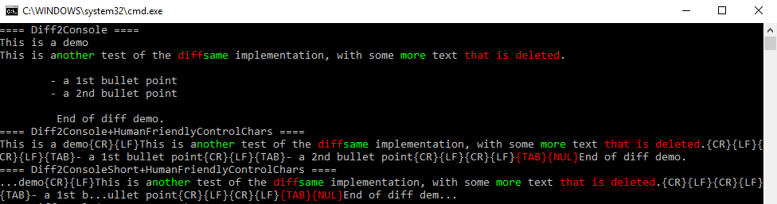
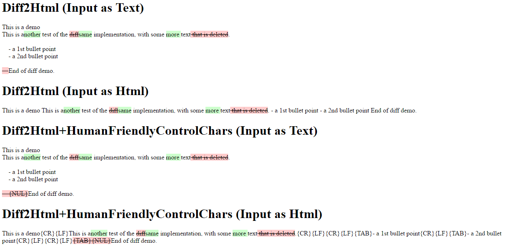

# CompuMaster.Text.Diff
Quickly dump a nicely formatted diff output to System.Console or to HTML

## Create quickly a colored diff-output to the system console


## Create quickly a colored diff-output to HTML


## Sample code
This is the full code to create above samples:
```c#
using System;
using System.Diagnostics;
using System.IO;

static class SampleMain
{
    public static void Main()
    {
        const string text1 = "This is a demo\nThis is a test of the diff implementation, with some text that is deleted.\n\n\t- a 1st bullet point\n\t- a 2nd bullet point\n\n\0End of diff demo.";
        const string text2 = "This is a demo\nThis is another test of the same implementation, with some more text.\n\n\t- a 1st bullet point\n\t- a 2nd bullet point\n\nEnd of diff demo.";

        Console.WriteLine("==== Diff2Console ====");
        CompuMaster.Text.Diffs.DumpDiffToConsole(text1, text2);
        Console.WriteLine();
        Console.WriteLine("==== Diff2Console+HumanFriendlyControlChars ====");
        CompuMaster.Text.Diffs.DumpDiffToConsole(text1, text2, true);
        Console.WriteLine();
        Console.WriteLine("==== Diff2ConsoleShort+HumanFriendlyControlChars ====");
        CompuMaster.Text.Diffs.DumpDiffToConsoleShort(text1, text2, true);
        Console.WriteLine();
        Console.WriteLine("==== Diff2Html (Input as Text) ====");
        string Text2HtmlOut = CompuMaster.Text.Diffs.DumpDiffAsHtml(text1, text2, CompuMaster.Text.Diffs.EncodingRequirement.TextInputToBeEncodedIntoHtmlBeforeOutput);
        Console.WriteLine(Text2HtmlOut);
        Console.WriteLine();
        Console.WriteLine("==== Diff2Html (Input as Html) ====");
        string Html2HtmlOut = CompuMaster.Text.Diffs.DumpDiffAsHtml(text1, text2, CompuMaster.Text.Diffs.EncodingRequirement.HtmlInputWithoutRequirementOfEncodingBeforeOutput);
        Console.WriteLine(Html2HtmlOut);
        Console.WriteLine();
        Console.WriteLine("==== Diff2Html+HumanFriendlyControlChars (Input as Text) ====");
        string Text2HtmlOutHumanFriendly = CompuMaster.Text.Diffs.DumpDiffAsHtml(text1, text2, CompuMaster.Text.Diffs.EncodingRequirement.TextInputToBeEncodedIntoHtmlBeforeOutput, true);
        Console.WriteLine(Text2HtmlOutHumanFriendly);
        Console.WriteLine();
        Console.WriteLine("==== Diff2Html+HumanFriendlyControlChars (Input as Html) ====");
        string Html2HtmlOutHumanFriendly = CompuMaster.Text.Diffs.DumpDiffAsHtml(text1, text2, CompuMaster.Text.Diffs.EncodingRequirement.HtmlInputWithoutRequirementOfEncodingBeforeOutput, true);
        Console.WriteLine(Html2HtmlOutHumanFriendly);
        Console.WriteLine();

        string TempHtmlFile = Path.GetTempFileName() + ".htm";
        File.WriteAllText(TempHtmlFile, "<h1>Diff2Html (Input as Text)</h1>" + Text2HtmlOut + "<h1>Diff2Html (Input as Html)</h1>" + Html2HtmlOut + "<h1>Diff2Html+HumanFriendlyControlChars (Input as Text)</h1>" + Text2HtmlOutHumanFriendly + "<h1>Diff2Html+HumanFriendlyControlChars (Input as Html)</h1>" + Html2HtmlOutHumanFriendly);
        System.Diagnostics.Process.Start(new System.Diagnostics.ProcessStartInfo(TempHtmlFile) { UseShellExecute = true });
    }
}
```

```vb.net
Module SampleMain

    Sub Main()
        Const text1 As String = "This is a demo" & vbNewLine & "This is a test of the diff implementation, with some text that is deleted." & vbNewLine & vbNewLine & vbTab & "- a 1st bullet point" & vbNewLine & vbTab & "- a 2nd bullet point" & vbNewLine & vbNewLine & vbTab & ControlChars.NullChar & "End of diff demo."
        Const text2 As String = "This is a demo" & vbNewLine & "This is another test of the same implementation, with some more text." & vbNewLine & vbNewLine & vbTab & "- a 1st bullet point" & vbNewLine & vbTab & "- a 2nd bullet point" & vbNewLine & vbNewLine & "End of diff demo."
        Console.WriteLine("==== Diff2Console ====")
        CompuMaster.Text.Diffs.DumpDiffToConsole(text1, text2)
        Console.WriteLine()
        Console.WriteLine("==== Diff2Console+HumanFriendlyControlChars ====")
        CompuMaster.Text.Diffs.DumpDiffToConsole(text1, text2, True)
        Console.WriteLine()
        Console.WriteLine("==== Diff2ConsoleShort+HumanFriendlyControlChars ====")
        CompuMaster.Text.Diffs.DumpDiffToConsoleShort(text1, text2, True)
        Console.WriteLine()
        Console.WriteLine("==== Diff2Html (Input as Text) ====")
        Dim Text2HtmlOut As String = CompuMaster.Text.Diffs.DumpDiffAsHtml(text1, text2, CompuMaster.Text.Diffs.EncodingRequirement.TextInputToBeEncodedIntoHtmlBeforeOutput)
        Console.WriteLine(Text2HtmlOut)
        Console.WriteLine()
        Console.WriteLine("==== Diff2Html (Input as Html) ====")
        Dim Html2HtmlOut As String = CompuMaster.Text.Diffs.DumpDiffAsHtml(text1, text2, CompuMaster.Text.Diffs.EncodingRequirement.HtmlInputWithoutRequirementOfEncodingBeforeOutput)
        Console.WriteLine(Html2HtmlOut)
        Console.WriteLine()
        Console.WriteLine("==== Diff2Html+HumanFriendlyControlChars (Input as Text) ====")
        Dim Text2HtmlOutHumanFriendly As String = CompuMaster.Text.Diffs.DumpDiffAsHtml(text1, text2, CompuMaster.Text.Diffs.EncodingRequirement.TextInputToBeEncodedIntoHtmlBeforeOutput, True)
        Console.WriteLine(Text2HtmlOutHumanFriendly)
        Console.WriteLine()
        Console.WriteLine("==== Diff2Html+HumanFriendlyControlChars (Input as Html) ====")
        Dim Html2HtmlOutHumanFriendly As String = CompuMaster.Text.Diffs.DumpDiffAsHtml(text1, text2, CompuMaster.Text.Diffs.EncodingRequirement.HtmlInputWithoutRequirementOfEncodingBeforeOutput, True)
        Console.WriteLine(Html2HtmlOutHumanFriendly)
        Console.WriteLine()
        Dim TempHtmlFile As String = System.IO.Path.GetTempFileName & ".htm"
        System.IO.File.WriteAllText(TempHtmlFile, "<h1>Diff2Html (Input as Text)</h1>" & Text2HtmlOut & "<h1>Diff2Html (Input as Html)</h1>" & Html2HtmlOut & "<h1>Diff2Html+HumanFriendlyControlChars (Input as Text)</h1>" & Text2HtmlOutHumanFriendly & "<h1>Diff2Html+HumanFriendlyControlChars (Input as Html)</h1>" & Html2HtmlOutHumanFriendly)
        System.Diagnostics.Process.Start(New System.Diagnostics.ProcessStartInfo(TempHtmlFile) With {.UseShellExecute = True})
    End Sub

End Module
```
